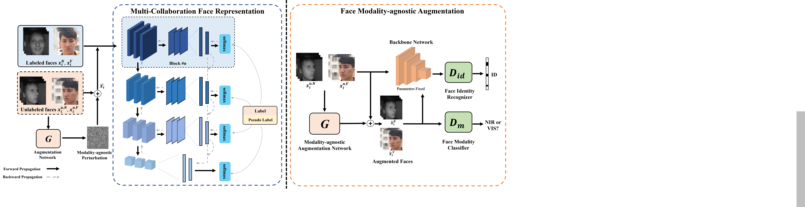

# Modality-agnostic Augmented Multi-Collaboration Representation for Semi-supervised Heterogeneous Face Recognition

This repo contains the source code for our ACM MM'23 work **Modality-agnostic Augmented Multi-Collaboration Representation for Semi-supervised Heterogeneous Face Recognition**. In the following is an instruction to use the code to train and evaluate our model.



## Dependencies

* Anaconda3 (Python 3.9, with Numpy etc.)
* Pytorch 1.12.1

## Datasets

[A Large-Scale Multi-Pose High-Quality Database (LAMP-HQ)](https://arxiv.org/abs/1912.07809) is a large-scale NIR-VIS face database with **56,788** NIR and **16,828** VIS images of **573** subjects. 

For each fold, the training set consists of almost 50% images from **300** subjects in the database. For the testing set, we select the rest **273** subjects, each with one VIS image and about **100** NIR images.


[CASIA NIR-VIS 2.0 dataset](https://ieeexplore.ieee.org/document/6595898) is widely used NIR-VIS face  dataset. This dataset contains **725** subjects. 

For each fold, the training set consists of about 6100 NIR images and **2500** VIS images from **360** identities. The test set consists of more than **6000** NIR and **358** VIS images from **358** identities, which are excluded from the training set.

[Tufts Face dataset](https://ieeexplore.ieee.org/document/8554155) is a large-scale public heterogeneous face database.

For the convenience of comparison, we choose the Thermal-VIS dataset, which contains **1583** paired thermal-VIS images from **112** subjects. we randomly select **90** subjects as the training set, the rest pairs are the testing set.

## Usage

### Prepare Database

1.Download face dataset such as CASIA NIR-VIS 2.0, LAMP-HQ and Tufts Face to the `./datasets` folder.

2.You can use RetinaFace for face detection and alignment, then crop face images to **128*128**. For more information, please refer to: https://github.com/serengil/retinaface.

3.Download the pre-trained weights for the LightCNN-29v4 model to the `./utils/weight` folder. You can obtain the model from: https://github.com/AlfredXiangWu/LightCNN.

### Prepare Protocol

ou can set up your own training and testing protocols, place them in `./datasets/Tufts/Protocol`, and specify the protocol in the yaml file to use it during training.

### Run the code

Please enter the main folder, and run
```bash
python train.py --c ./config/Tufts.yml
```

Then, you can modify the `WEIGHTS` in the `./config/Tufts_attack.yml` file to specify a suitable model weight (the checkpoint file is saved in `./log/Tufts`) to obtain the MAA augmented images under that weight by running the code:
```bash
python attack.py --c ./config/Tufts_attack.yml
```

Finally, you can fine-tune the model to achieve the best performance by running the code:
```bash
python train.py --c ./config/Tufts_funetrain.yml
```

### Main results

LAMP-HQ:
|   Model | Labeled ratio | Rank-1 | VR@FAR=1%   | VR@FAR=0.1%| VR@FAR=0.01% | 
| :------- | :----: | :---: | :---: |:---: | :---: | 
| LightCNN| full | 95.8% | 95.5% | 82.4% | 62.5% |
| DVG | full |98.3% |    99.0%    |    96.4%  |    88.6%  | 
| FSIAD |full | 98.7% |    99.2%    |    97.3%  |    92.6%  | 
| Ours | 3/5 |99.2% |    99.4%    |    99.0%  |    97.0%  |

CASIA NIR-VIS 2.0:
|   Model | Labeled ratio | Rank-1 | VR@FAR=1%   | VR@FAR=0.1%|
| :------- | :----: | :---: | :---: |:---: | 
| LightCNN| full | 96.7% | 94.8% | 88.5% |
| DVG | full |99.8% |    99.8%    |    98.8%  |
| FSIAD |full | 99.9% |    99.9%    |    99.2%  |
| Ours | 3/5 |99.9% |    99.9%    |    99.8%  |

Tufts Face:
|   Model | Labeled ratio | AUC | EER  | VR@FAR=1%|
| :------- | :----: | :---: | :---: |:---: | 
| DA-GAN | full | 75.2% | 31.1% | 10.4% |
| MMTN |full | 92.6% |    15.7%    |  27.8%  |  
| MixMatch |3/5 | 84.8% |    23.6%    |    20.8%  |
| FixMatch |3/5 | 95.7% |    11.2%    |    35.1%  |
| Ours | 3/5 |98.0% |    6.3%    |    63.3%  |


## BibTeX

## References

[LightCNN](https://github.com/AlfredXiangWu/LightCNN)，
[RetinaFace](https://github.com/serengil/retinaface).
